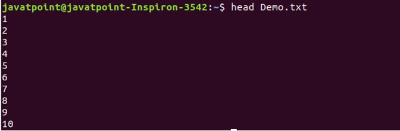

# 19CS416-CS-Ex-3-Linux-Commands

**Linux** is an open-source operating system, and its kernel is the heart of the OS, facilitating communication between hardware and software. One of the key advantages of Linux is its customizability; developers can modify the Linux kernel to create their own tailored operating systems.

## Linux Commands

Linux commands are executed in the terminal, which is case-sensitive. This guide covers some basic and advanced commands used in Linux.

### 1. `ls` Command

The `ls` command is used to display a list of contents in a directory.

**Syntax:** 
```bash
ls
```

**Output:**


### 2. `pwd` Command

The `pwd` command displays the location of the current working directory.

**Syntax:**
```bash
pwd
```

**Output:** 


### 3. `mkdir` Command

The `mkdir` command is used to create a new directory.

**Syntax:**
```bash
mkdir <directory_name>
```

**Output:**


### 4. `rmdir` Command

The `rmdir` command is used to delete a directory.

**Syntax:**
```bash
rmdir <directory_name>
```

**Output:**


### 5. `cd` Command

The `cd` command is used to change the current directory.

**Syntax:**
```bash
cd <directory_name>
```

**Output:**


### 6. `cat` Command

The `cat` command is used to create, display, and concatenate files.

**Syntax:**
```bash
cat [OPTION]... [FILE]...
```

**Output:**


### 7. `cp` Command

The `cp` command is used to copy files or directories.

**Syntax:**
```bash
cp <source_file> <destination_file>
```

**Output:**


### 8. `gedit` Command

`gedit` is a general-purpose text editor used to create and edit text files.

**Syntax:**
```bash
gedit <file_name>
```

**Output:**


### 9. `su` Command

The `su` command provides administrative access to another user.

**Syntax:**
```bash
su <username>
```

**Output:**


### 10. `mv` Command

The `mv` command is used to move a file or directory from one location to another.

**Syntax:**
```bash
mv <file_name> <directory_path>
```

**Output:**


### 11. `rename` Command

The `rename` command is used to rename files.

**Syntax:**
```bash
rename 's/old-name/new-name/' <files>
```

**Output:**


### 12. `head` Command

The `head` command displays the first 10 lines of a file.

**Syntax:**
```bash
head <file_name>
```

**Output:**



### 13. `tail` Command

The `tail` command displays the last 10 lines of a file.

**Syntax:**
```bash
tail <file_name>
```

**Output:**


### 14. `id` Command

The `id` command displays the user ID (UID) and group ID (GID).

**Syntax:**
```bash
id
```

**Output:**


### 15. `grep` Command

The `grep` command is used to search for a pattern within files.

**Syntax:**
```bash
command | grep <search_word>
```

**Output:**


### 16. `tr` Command

The `tr` command is used to translate or delete characters.

**Syntax:**
```bash
command | tr <old> <new>
```

**Output:**


### 17. `chmod` Command

The `chmod` command is used to change the access mode (permissions) of a file.

**Syntax:**
```bash
chmod <options> <permissions> <file_name>
```

**Output:**


### 18. `tar` Command

The `tar` command is used to create or extract archive files.

**Syntax:**
```bash
tar [options] [archive-file] [files_to_archive]
```

**Output:**


### 19. `chown` Command

The `chown` command is used to change the ownership of a file.

**Syntax:**
```bash
chown <owner_name> <file_name>
```

**Output:**


### 20. `make` Command

The `make` command is used to build and maintain groups of programs.

**Syntax:**
```bash
make [-f makefile] [options] [targets]
```

**Output:**


### 21. `ifconfig` Command

The `ifconfig` command is used to configure network interfaces.

**Syntax:**
```bash
ifconfig [options] [interface]
```

**Output:**


### 22. `host` Command

The `host` command is used to display the IP address for a given domain name.

**Syntax:**
```bash
host <domain_name> or <ip_address>
```

**Output:**


### 23. `gzip` Command

The `gzip` command is used to compress files, replacing the original file with a compressed one with a `.gz` extension.

**Syntax:**
```bash
gzip <file1> <file2> <file3>...
```

**Output:**


### 24. `sort` Command

The `sort` command is used to sort the contents of a file alphabetically.

**Syntax:**
```bash
sort <file_name>
```

**Output:**


### 25. `cal` Command

The `cal` command displays the current month's calendar with the current date highlighted.

**Syntax:**
```bash
cal
```

**Output:**


### 26. `clear` Command

The `clear` command clears the terminal screen.

**Syntax:**
```bash
clear
```

**Output:**


### 27. `mail` Command

The `mail` command is used to send emails from the command line.

**Syntax:**
```bash
mail
```

**Output:**


### 28. `df` Command

The `df` command displays the disk space usage of file systems.

**Syntax:**
```bash
df
```

**Output:**


### 29. `find` Command

The `find` command is used to search for files in a directory hierarchy.

**Syntax:**
```bash
find <directory> -name <file_name>
```

**Output:**


## Result
All basic and advanced operations were successfully performed through appropriate Linux commands, with the system responding accurately to each, confirming correct execution and expected behavior, thereby demonstrating the effectiveness and reliability of the Linux command-line interface for comprehensive system management.
